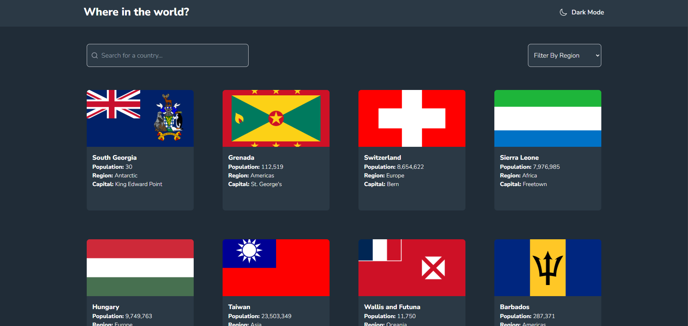

# Where in the World?

This project is a solution to the [Where in the World?](https://www.frontendmentor.io/challenges/rest-countries-api-with-color-theme-switcher-5cacc469fec04111f7b848ca) challenge on Frontend Mentor.

## Table of Contents

- [Where in the World?](#where-in-the-world)
  - [Table of Contents](#table-of-contents)
  - [Overview](#overview)
    - [The Challenge](#the-challenge)
    - [Screenshot](#screenshot)
    - [Links](#links)
  - [My Process](#my-process)
    - [Built With](#built-with)
    - [What I Learned](#what-i-learned)
    - [Continued Development](#continued-development)
    - [Useful Resources](#useful-resources)
  - [Author](#author)

## Overview

### The Challenge

Users should be able to:

- See all countries from the API on the homepage
- Search for a country using an input field
- Filter countries by region
- Click on a country to see more detailed information on a separate page
- Toggle the color scheme between light and dark mode

### Screenshot

### Links

- Solution URL: [GitHub Repository](https://github.com/WalkerFGZ/rest-countries-v2)
- Live Site URL: [Live Demo](https://where-in-the-world-sooty.vercel.app/)

## My Process

### Built With

- [React](https://reactjs.org/) - JS library
- [Tailwind CSS](https://tailwindcss.com/) - For styles
- [Redux Toolkit](https://redux-toolkit.js.org/) - For state management
- [React Router](https://reactrouter.com/) - For routing
- [Vercel](https://vercel.com/) - For deployment

### What I Learned

This project helped me improve my skills in:

- Using Tailwind CSS for styling
- Managing state with Redux Toolkit
- Implementing dark mode with Tailwind CSS
- Fetching data from an API and handling asynchronous operations
- Using React Router for navigation

### Continued Development

In future projects, I plan to:

- Improve accessibility features
- Add more detailed error handling
- Optimize performance for large datasets

### Useful Resources

- [Frontend Mentor](https://www.frontendmentor.io/) - This challenge was taken from Frontend Mentor.
- [Tailwind CSS Documentation](https://tailwindcss.com/docs) - Tailwind CSS docs helped me with styling.
- [Redux Toolkit Documentation](https://redux-toolkit.js.org/introduction/getting-started) - Redux Toolkit docs helped me with state management.

## Author

- Frontend Mentor - [@yourusername](https://www.frontendmentor.io/profile/WalkerFGZ)
- GitHub - [@yourusername](https://github.com/WalkerFGZ/)
